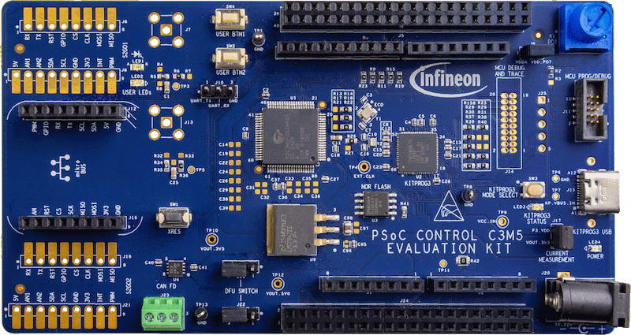

# KIT_PSC3M5_EVK BSP

## Overview

The PSOC™ Control C3 MCU Evaluation Kit (KIT_PSC3M5_EVK) is based on the PSOC™ Control family of devices.  It enables the evaluation and development of applications for the PSOC™ Control C3 MCU.

To use code from the BSP, simply include a reference to `cybsp.h`.

## Features

### Kit Features:

* PSoC™ Control C3M5 (Arm® Cortex®-M33 based) Microcontroller
* PSOC™ 5LP based KitProg3 programmer and debugger with USB Type-C connector
* Two user LEDs, two user buttons, and a reset button for the PSC3M5
* Headers compatible with MIKROE’s mikroBUS shields
* Headers compatible with Arduino Uno R3
* Mode button and a mode LED for KitProg3
* Potentiometer that can be used to simulate analog sensor output

### Kit Contents:

* PSOC™ Control C3M5 Evaluation Kit
* USB Type-A to Type-C cable
* Jumper wires
* Quick start guide (printed on kit package)

## BSP Configuration

The BSP has a few hooks that allow its behavior to be configured. Some of these items are enabled by default while others must be explicitly enabled. Items enabled by default are specified in the KIT_PSC3M5_EVK.mk file. The items that are enabled can be changed by creating a custom BSP or by editing the application makefile.

Components:
* Device specific category reference (e.g.: CAT1) - This component, enabled by default, pulls in any device specific code for this board.

Defines:
* CYBSP_WIFI_CAPABLE - This define, disabled by default, causes the BSP to initialize the interface to an onboard wireless chip if it has one.
* CY_USING_HAL - This define, enabled by default, specifies that the HAL is intended to be used by the application. This will cause the BSP to include the applicable header file and to initialize the system level drivers.
* CYBSP_CUSTOM_SYSCLK_PM_CALLBACK - This define, disabled by default, causes the BSP to skip registering its default SysClk Power Management callback, if any, and instead to invoke the application-defined function `cybsp_register_custom_sysclk_pm_callback` to register an application-specific callback.

### Clock Configuration

| Clock    | Source    | Output Frequency |
|----------|-----------|------------------|
| FLL      | IMO       | 100.0 MHz        |
| CLK_HF0  | CLK_PATH1 | 180 MHz          |
| CLK_HF1  | CLK_PATH1 | 180 MHz          |
| CLK_HF2  | CLK_PATH0 | 100 MHz          |
| CLK_HF3  | CLK_PATH2 | 240 MHz          |
| CLK_HF4  | CLK_PATH0 | 100 MHz          |

### Power Configuration

* System Active Power Mode: OD
* System Idle Power Mode: CPU Sleep 
* VDDA Voltage: 3300 mV
* VDDD Voltage: 3300 mV

See the [BSP Setttings][settings] for additional board specific configuration settings.

## API Reference Manual

The KIT_PSC3M5_EVK Board Support Package provides a set of APIs to configure, initialize and use the board resources.

See the [BSP API Reference Manual][api] for the complete list of the provided interfaces.

## More information
* [KIT_PSC3M5_EVK BSP API Reference Manual][api]
* [KIT_PSC3M5_EVK Documentation](http://www.infineon.com/KIT_PSC3M5_EVK)
* [Cypress Semiconductor, an Infineon Technologies Company](http://www.cypress.com)
* [Infineon GitHub](https://github.com/infineon)
* [ModusToolbox™](https://www.cypress.com/products/modustoolbox-software-environment)

[api]: https://infineon.github.io/TARGET_KIT_PSC3M5_EVK/html/modules.html
[settings]: https://infineon.github.io/TARGET_KIT_PSC3M5_EVK/html/md_bsp_settings.html

---
© Cypress Semiconductor Corporation (an Infineon company) or an affiliate of Cypress Semiconductor Corporation, 2019-2024.